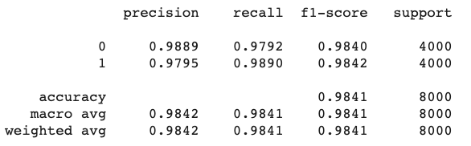

# Detecting Clickbaits (1) - Universal-Sentence-Encoder Transfer Learning


**Problem**.
Given a set of headlines and labels, whether that headline is a clickbait or 
not, you're asked to build a model to detect clickbait headlines.

**Solution**.

Read data:

```
df = pd.read_csv("https://raw.github.com/hminooei/DSbyHadi/master/data/clickbait_data.csv.zip")
df.head(3)
```


Split into train/validation/test sets:

```
text_train_val, text_test, label_train_val, label_test = train_test_split(
    df["headline"], 
    df["clickbait"], 
    test_size=0.25, 
    stratify=df["clickbait"], 
    random_state=9)

# Split the train_val dataset to train and validation separete portions.
text_train, text_val, label_train, label_val = train_test_split(
    text_train_val,
    label_train_val, 
    test_size=0.2, 
    random_state=9)
```

Read Universal Sentence Encoder pre-trained network and its weights from 
tensorflow hub, set the weights as trainable (`trainable=True`), 
and add a final output layer with sigmoid activation since it's a binary 
classifier:
```
input = tf.keras.layers.Input(shape=[], dtype=tf.string)
use = hub.KerasLayer("https://tfhub.dev/google/universal-sentence-encoder/4", trainable=True)(input)
output = tf.keras.layers.Dense(1, activation="sigmoid")(use)
model = tf.keras.models.Model(input, output)

model.summary()
```

Train for 2 epochs:
```
model.fit(text_train, 
          label_train,
          epochs=2,
          validation_data=(text_val, label_val),
          verbose=2)
```

Then we can measure the precision and recall on our test set:
```
label_preds_classes_test = np.round(model.predict(text_test))
test_metrics = metrics.classification_report(label_test, label_preds_classes_test, labels=[0, 1], digits=4)
print(test_metrics)
```



**Important Points**:
- The training time: 45 min on Google Colab (TPUs)
- Macro precision on test set: 0.9842
- Inference time per record:


**Note** 
- The complete code for this post can be found at https://github.com/hminooei/DSbyHadi/blob/master/blog/clickbait_transfer_learning.ipynb
It's recommended to run this notebook in Google Colab.
- For other solutions for this problem, please refer to the next posts.
- The dataset was originally taken from Kaggle https://www.kaggle.com/amananandrai/clickbait-dataset. 
